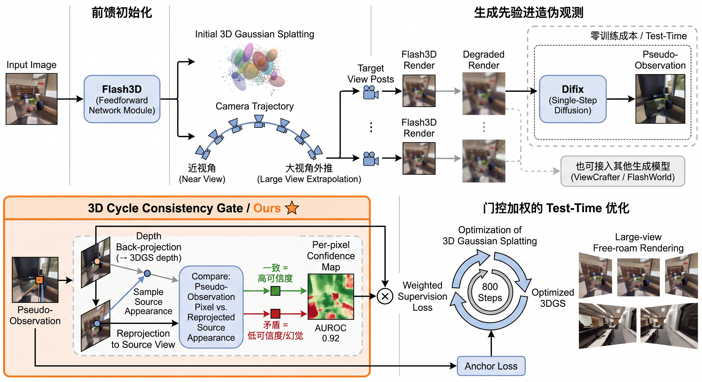

# 三维重建

基于生成先验引导的单视图场景级三维重建研究。

<p align="center">
  
</p>

## 目录结构

```
3d-reconstruction/
├── docs/                  # 研究文档、决策日志、实验计划
├── thesis/                # 毕设章节（大纲 + 正文）
├── papers/                # 论文 LaTeX 源码
│   ├── paper1_latex/      # Paper1: 选择性生成注入
│   ├── paper2_latex/      # Paper2: Gate-aware 蒸馏
│   ├── paper3_latex/      # Paper3: 可靠性学习
│   └── paper_difix_latex/ # Difix 相关
├── experiments/           # 核心实验脚本
├── sv3d-lab/              # sv3d-lab 研究代码
│   ├── paper_a_explicit3d/  # Paper A: 源锚定测试时高斯补全
│   ├── paper_b_generative3d/ # Paper B: 生成式 3D 补全
│   ├── common/            # 共用几何/渲染/可见性工具
│   ├── eval/              # 评估脚本
│   ├── baselines/         # 基线方法适配
│   ├── scripts/           # 数据下载/处理脚本
│   └── configs/           # 训练/评估配置
├── eval-suite/            # 统一评测套件（FID/KID/DISTS/LPIPS/PSNR）
├── results/               # 实验结果与发布材料
│   └── github_release/    # 可发布的结果、表格、可复现脚本
└── scripts/               # 通用工具脚本
```

## 研究路线

### 路线一：CycleFusion（毕设主章）
以 Difix 保真修复作为稳定几何锚点，ViewCrafter/FlashWorld 作为候选生成先验；
3D-cycle 门控通过跨视角回投一致性估计逐像素可信度，只在可信区域注入生成监督。
测试时优化 3DGS，无需额外训练。

**核心结果**：
- RE10K big50 FID: 100.5 → 77.5 (-23%)
- 3D-cycle AUROC: 0.9227 vs 2D baseline 0.7144

### 路线二：源锚定测试时高斯补全（sv3d-lab Paper A）
冻结 Flash3D 前馈重建，per-scene 优化添加隐藏区 Gaussians，
source-null 约束保证源视图不被破坏。

**核心结果**（leakage-free hold-out）：
- Wide700 全量: 整体 +0.64 dB PSNR, 隐藏区 +2.76 dB
- 标准协议: 整体 +0.35 dB, LPIPS +0.030

### 路线三：选择性生成注入 + Gate-aware 蒸馏
不对称几何注入 + 测试时可靠性门控，遮挡区 PSNR +2.07 dB；
Gate-aware 蒸馏：23% 数据超越全量 baseline（Δ 提升 2.7×）。

## 数据集
- **RealEstate10K**: 158 场景（候选池），MINE 协议 641 场景
- **ACID**: 40 场景（跨数据集泛化验证）

## 服务器环境
- GPU: 1× RTX A6000 48GB
- SSH: `ssh -p 10244 root@10.44.6.60`
- Flash3D: `/root/projects/flash3d/`
- RE10K: `/home/data/RealEstate10K/`
