# 单视图场景三维重建：选择性生成、先验蒸馏与可靠性审计

本仓库包含三篇相互衔接的论文，围绕同一条主线展开：

> **先分析生成先验在什么情况下有效，再研究如何压缩有效行为，最后审计能否仅凭推理时可见的信息判断何时使用生成先验。**

```text
Paper 1：选择性生成诊断
        ↓ 提供慢速生成教师与有效/失败案例
Paper 2：生成先验蒸馏
        ↓ 把有用行为压缩进小型前馈网络
Paper 3：可靠性证据审计
        ↓ 检查真实可观测证据能否支持安全选择
```

| 论文 | 核心问题 | 主要结论 | 入口 |
|---|---|---|---|
| **Paper 1：选择性几何引导生成** | 几何证据何时能改善生成式单视图重建？ | 注入收益具有明显难度依赖；GT-quality probe 可诊断选择性，但当前 visibility 来自完整目标序列，只能作为离线 oracle 诊断 | [目录](paper1_selective_generation/) · [PDF](paper1_selective_generation/paper/main.pdf) |
| **Paper 2：选择性反遮挡先验蒸馏** | 能否把慢速生成教师的有用行为压缩进前馈学生？ | 在 oracle 筛选和 oracle visibility 条件下，TinyStudent 保留 94.7% 教师增益，并获得 2833× 加速 | [目录](paper2_gate_aware_distillation/) · [PDF](paper2_gate_aware_distillation/paper/main.pdf) · [Checkpoint](paper2_gate_aware_distillation/checkpoints/student.pt) |
| **Paper 3：反遮挡可靠性证据审计** | 推理时可观测证据能否判断教师是否会带来提升？ | GT-quality probe 的诊断 AUC 很高，但真正可观测的 camera-only 证据只有 AUC 0.650，尚不足以支持安全部署 | [目录](paper3_reliability_learning/) · [PDF](paper3_reliability_learning/paper/main.pdf) |

---

# Paper 1：选择性几何引导生成

## 论文简介

单视图重建存在天然的不对称性：输入视角中可见区域有真实图像证据，而新视角中的反遮挡区域必须依赖先验补全。Paper 1 在 latent 中仅对 oracle visibility mask 标记的不可见位置注入 Flash3D 几何证据；可见 latent 路径保持不变，但 VAE 解码后的最终 RGB 并不保证逐像素不变。论文系统分析：

- 哪些场景适合注入；
- 哪些场景注入会失败；
- 注入收益与组件质量差之间的关系；
- 这种规律是否能跨数据集保持。

**证据边界：** visibility mask 由 VGGT 使用完整目标序列预计算，因此这是 **offline oracle-visibility 诊断**，不是可直接部署的单图推理系统。质量差选择同样使用 GT-derived probe，属于 oracle selectivity 分析。

## Pipeline

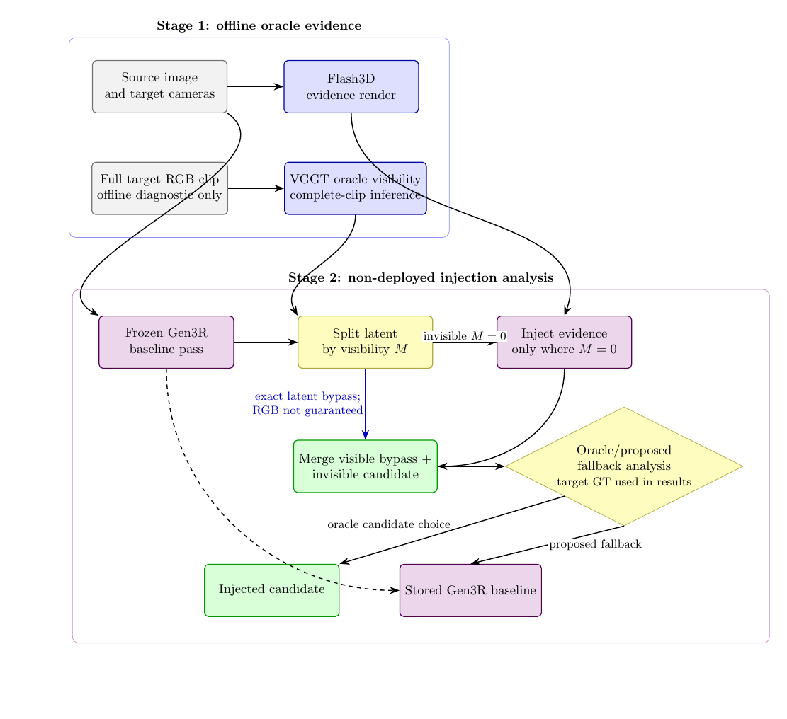

## 明显效果图

### 1. 窗户结构恢复：局部 PSNR +12.58 dB

Gen3R 在黄色框内把窗户区域生成成模糊墙面；注入后重新出现窗框、窗格和植物结构。

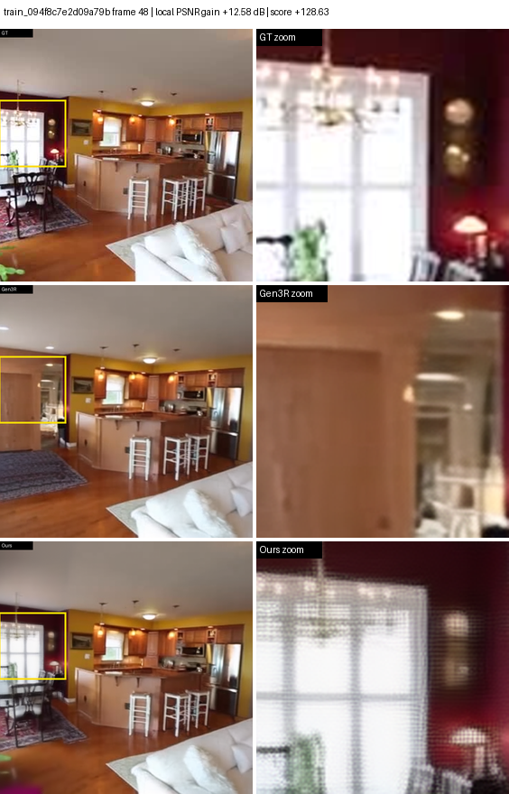

### 2. 门廊与地板恢复：局部 PSNR +12.53 dB

Gen3R 在新显露区域生成了错误的淋浴间结构；注入结果恢复了门廊、墙面与木地板布局。

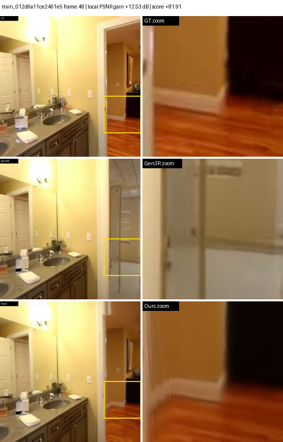

### 3. 沙发与窗户恢复：局部 PSNR +5.54 dB

Gen3R 将沙发和窗户区域错误生成为桌面/墙体；注入后恢复了沙发轮廓、窗户与靠垫颜色。

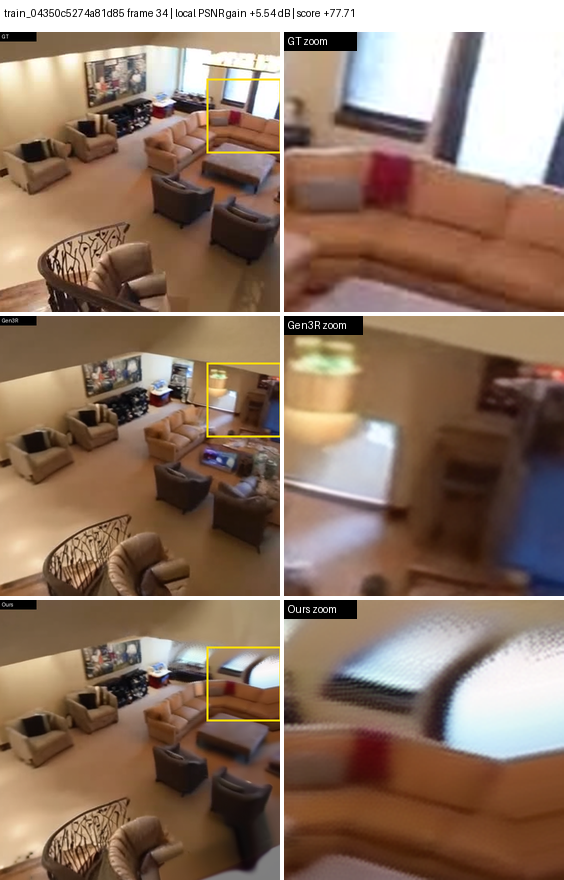

### 4. 多视角成功与失败案例

黄色框在 GT、Gen3R、注入结果和误差图中使用同一个 ROI，便于直接比较。

<table>
<tr>
<td width="50%">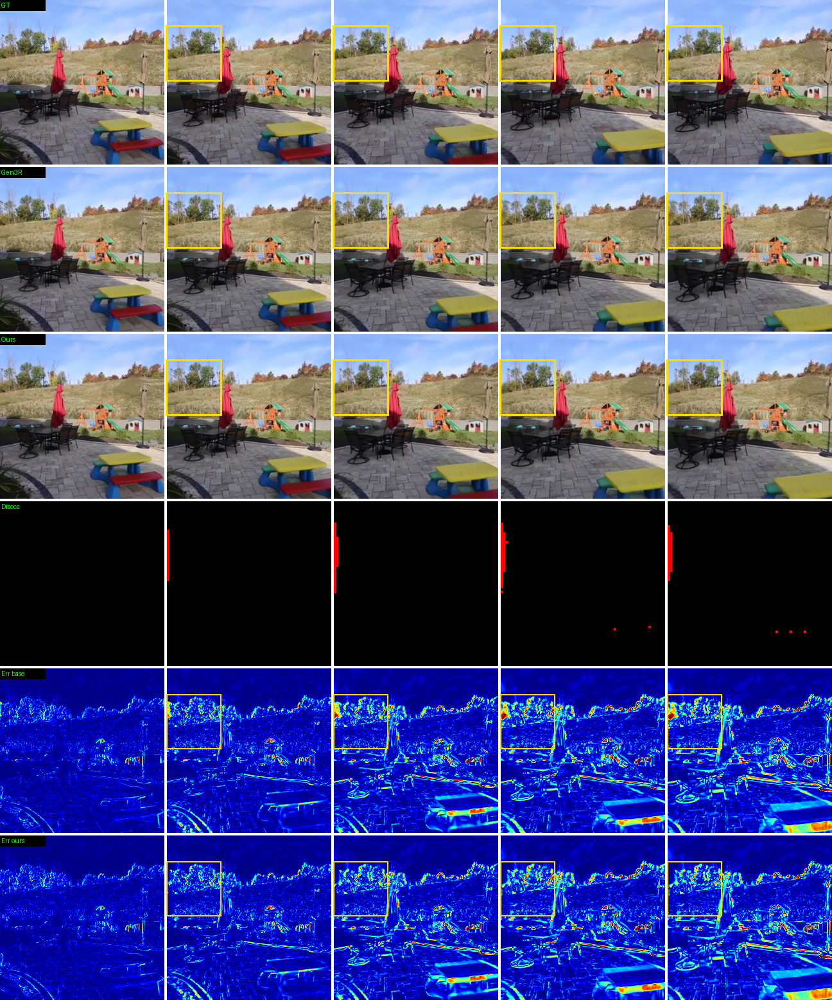</td>
<td width="50%">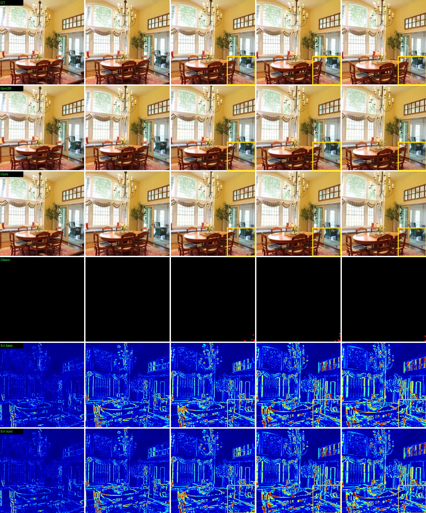</td>
</tr>
<tr>
<td align="center">成功案例：注入降低框内误差</td>
<td align="center">失败案例：说明需要可靠性判断</td>
</tr>
</table>

## 核心数据

### 机制与选择性诊断

| 指标 | 结果 | 含义 |
|---|---:|---|
| 主数据集规模 | **166 scenes** | RealEstate10K 长序列诊断 |
| 组件质量差与注入收益相关性 | **r = 0.982** | 质量差可作为强诊断信号，但依赖 GT probe |
| Oracle gap=5 选择平均增益 | **+1.658 dB** | oracle selectivity 上界，不是部署 gate |
| Hard 场景 always-inject | **+2.49 dB** | 困难场景更容易受益 |
| Easy 场景 always-inject | **−2.52 dB** | 简单场景可能被注入破坏 |
| 直接 16-scene 实验可见区变化 | **+0.016 dB** | latent bypass 不等于最终 RGB 严格不变 |

### 固定 759-frame 自定义诊断

| 方法/变体 | PSNR ↑ | SSIM ↑ | LPIPS-VGG ↓ | FID ↓ | KID ↓ |
|---|---:|---:|---:|---:|---:|
| Gen3R baseline | 17.77 | 0.653 | 0.360 | 31.8 | 0.0020 |
| Flash3D evidence | **19.76** | **0.679** | 0.444 | 54.8 | 0.0096 |
| **Injected output** | 19.22 | 0.676 | **0.341** | **31.1** | 0.0028 |

> 该表是同一批 759 个 disocclusion-heavy frames 上的组件诊断，不是官方 Flash3D/MINE 排行榜比较。

### ACID 跨数据集零样本诊断

| 指标 | 结果 |
|---|---:|
| 有效场景数 | 8 |
| Always-inject 平均变化 | **−0.443 dB** |
| 提升场景 | 3 / 8 |
| Gen3R / Injected LPIPS | 0.383 / 0.408 |

ACID 平均结果为负，说明选择规律和 visibility 构造具有数据集依赖性；这也是论文保留的重要失败证据。

**入口：** [论文目录](paper1_selective_generation/) · [PDF](paper1_selective_generation/paper/main.pdf) · [协议说明](paper1_selective_generation/PROTOCOL.md) · [图表复现](TABLES_AND_FIGURES.md)

---

# Paper 2：选择性反遮挡先验蒸馏

## 论文简介

Paper 2 研究如何把 Paper 1 的慢速生成教师压缩成小型前馈网络。TinyStudent 接收 Flash3D evidence、Gen3R baseline 和 oracle visibility mask，预测图像空间残差。

训练集由 GT/teacher gain 进行 oracle 筛选，因此该实验回答的是：

> **在有利场景已知、visibility 已知的上界条件下，生成先验能被压缩到多小、多快？**

它不声称已经解决未知场景上的推理时 selector。

## Pipeline

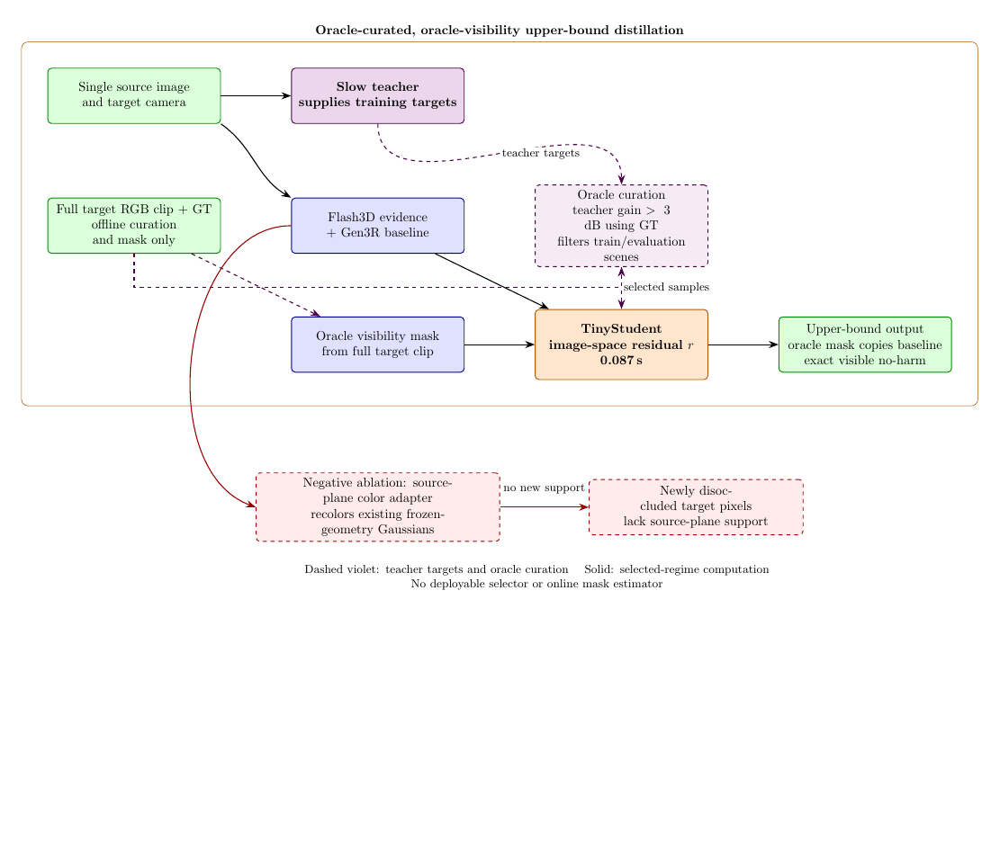

## 效果图：质量—速度关系

下图来自固定 21-scene / 759-frame 自定义诊断。横轴是每场景运行时间，纵轴分别为 LPIPS-VGG 与 FID；越靠左、越靠下越好。

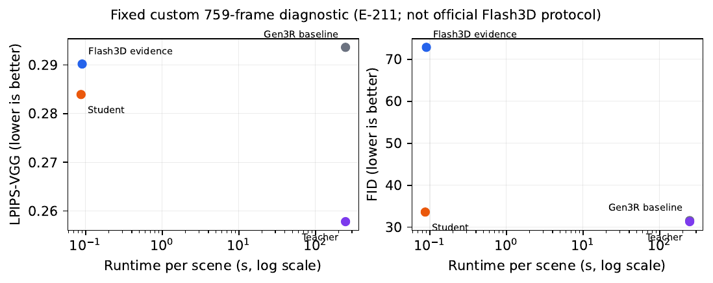

## 核心数据

### 蒸馏质量与速度

| 指标 | Teacher | TinyStudent | 结果 |
|---|---:|---:|---|
| Holdout invisible-region 增益 | +6.09 dB | **+5.77 dB** | 保留 **94.7%** 教师增益 |
| Holdout invisible PSNR | 20.13 dB | 19.81 dB | 相差 0.32 dB |
| 可见区域变化 | — | **+0.000 dB** | 在 oracle mask 图像合成下复制 baseline |
| 运行时间 / scene | 247 s | **0.087 s** | **2833×** 加速 |
| 参数量 | — | **46,371** | 小型四层 CNN |

### 固定 759-frame 质量诊断

| 方法 | PSNR ↑ | LPIPS-VGG ↓ | FID ↓ | 时间 / scene |
|---|---:|---:|---:|---:|
| Gen3R baseline | 17.88 | 0.294 | 31.6 | 247 s |
| Flash3D evidence | **19.98** | 0.290 | 72.9 | 0.09 s |
| Slow teacher | 19.37 | **0.258** | **31.3** | 247 s |
| **TinyStudent** | 18.17 | 0.284 | 33.6 | **0.087 s** |

### 负消融

| 方法 | 结果 |
|---|---:|
| 单场景过拟合 Gaussian color adapter | 仅恢复约 7% teacher gap |
| Holdout Gaussian color adapter | **−1.72 dB** |

该负结果表明：只重着色已有、冻结几何的源视图 Gaussian，无法在新显露区域创造新的几何支持，因此论文选择图像空间残差学生。

**入口：** [论文目录](paper2_gate_aware_distillation/) · [PDF](paper2_gate_aware_distillation/paper/main.pdf) · [Checkpoint](paper2_gate_aware_distillation/checkpoints/student.pt) · [模型卡](paper2_gate_aware_distillation/MODEL_CARD.md) · [训练清单](paper2_gate_aware_distillation/TRAINING_MANIFEST.md)

---

# Paper 3：反遮挡可靠性证据审计

## 论文简介

Paper 3 不再把可靠性路由包装成已解决问题，而是审计不同证据是否真正跨越了推理边界：

1. **Oracle true gain**：使用教师与 GT，只能定义上界；
2. **GT-quality probe**：诊断上可分，但不能部署；
3. **Camera-only**：真正可观测，但区分能力有限；
4. **RGB + oracle visibility**：仍依赖完整目标序列生成的 visibility，不是真正单图可观测。

## Evidence-tier Pipeline

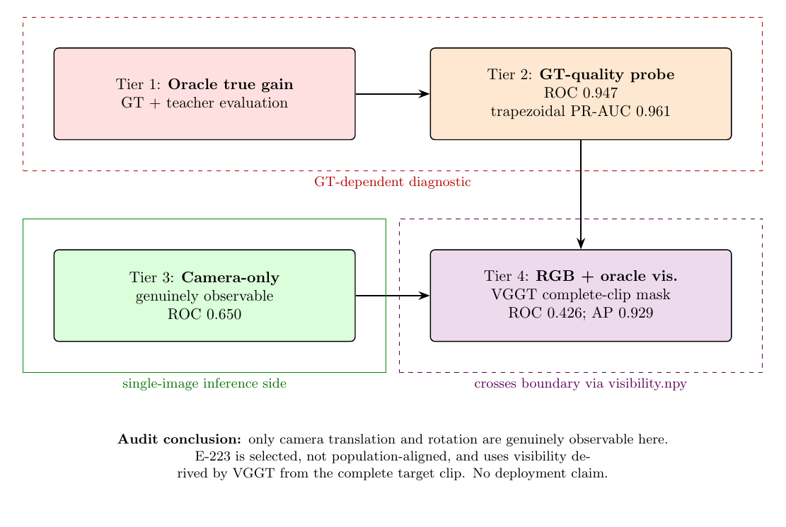

## 效果图 1：证据与粒度差异

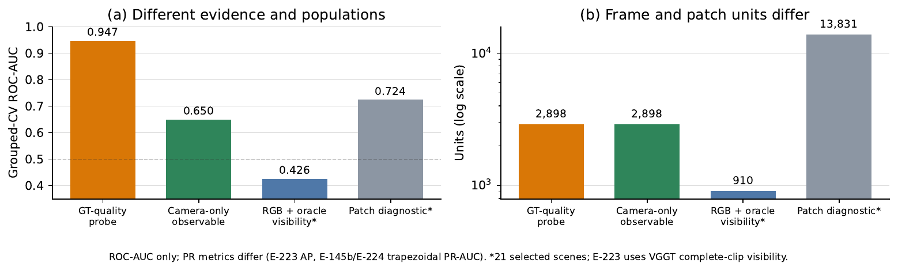

这张图强调：0.947、0.650、0.426 和 patch 0.724 来自不同证据/不同 population，不能当作同一排行榜直接比较。

## 效果图 2：GT-quality probe 诊断条带

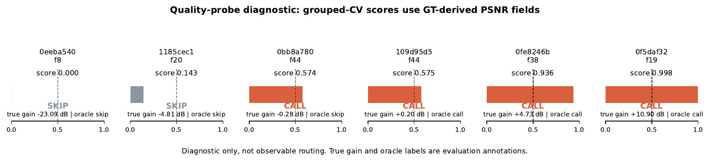

该图只展示 GT-derived quality probe 的分离能力。`CALL/SKIP` 是离线诊断，不是可部署路由策略。

## 核心数据

| 证据层级 | Population | 输入证据 | ROC-AUC | PR 指标 | 策略表现 |
|---|---|---|---:|---:|---|
| Oracle true gain | 2,898 frames / 74 scenes | 真实 teacher gain | — | — | +1.70 dB 上界 |
| GT-quality probe | 2,898 / 74 | GT-derived PSNR probes + camera | **0.947** | trapezoidal PR-AUC 0.961 | +1.604 dB，41% calls saved（诊断） |
| **Camera-only observable** | 2,898 / 74 | translation + rotation | **0.650** | trapezoidal PR-AUC 0.663 | +0.715 dB；worst −23.094 dB；30% saved |
| RGB + oracle visibility | 910 / 21 selected scenes | RGB disagreement + full-clip visibility | 0.426 | AP 0.929* | threshold 0.5 调用全部 910 frames |
| Patch diagnostic | 13,831 patches / 21 selected scenes | 局部 RGB/visibility probe | 0.724 | AP 0.843 | 与 frame population/metric 不可直接比较 |

`*` RGB population 中 96.5% 样本为正例，AP 受类别比例强烈影响，因此不能据此声称可靠性预测有效。

**审计结论：** 当前真正可观测的 camera-only 特征仍然太弱，并保留了 −23.094 dB 的严重失败；现有证据不足以建立安全、可部署的 selector。

**入口：** [论文目录](paper3_reliability_learning/) · [PDF](paper3_reliability_learning/paper/main.pdf) · [审计协议](paper3_reliability_learning/PROTOCOL.md) · [E-224 observable 结果](paper3_reliability_learning/results/E-224_camera_only_observable.json)

---

# 复现与仓库结构

## 一键 Smoke Test

```bash
python3 -m pip install -r requirements.txt
python3 scripts/smoke_test.py
```

预期输出包含：

```text
Paper1 scenes: 166
Paper3 frames: 2898
TinyStudent output: (1, 3, 64, 64)
SMOKE PASS
```

## 目录

```text
paper1_selective_generation/    Paper 1：论文、图片、结果、分析脚本
paper2_gate_aware_distillation/ Paper 2：论文、checkpoint、模型卡、训练与评测脚本
paper3_reliability_learning/    Paper 3：审计论文、协议、observable/diagnostic 结果
assets/                         GitHub 主页图片
manifests/                      场景与帧清单
scripts/                        全仓库 smoke / manifest 工具
```

## 重要文档

- [完整复现说明](REPRODUCIBILITY.md)
- [协议边界](PROTOCOLS.md)
- [表格与图片复现命令](TABLES_AND_FIGURES.md)
- [模型与 Checkpoint](MODEL_ZOO.md)
- [License](LICENSE)
- [Citation](CITATION.cff)

## 统一证据边界

- Paper 1/2 的 visibility 来自完整目标序列，属于 **oracle visibility**；
- Paper 1 的 quality-gap 选择使用 GT-derived probe，属于 **oracle selectivity**；
- Paper 2 使用 oracle 高收益数据筛选，未发布可部署 selector；
- Paper 3 的 0.947 AUC 是 quality-probe 诊断上界，真正可观测 camera-only AUC 为 0.650；
- Flash3D、pixelSplat、DepthSplat 等官方数字只用于协议定位，不进行跨协议胜负比较。
